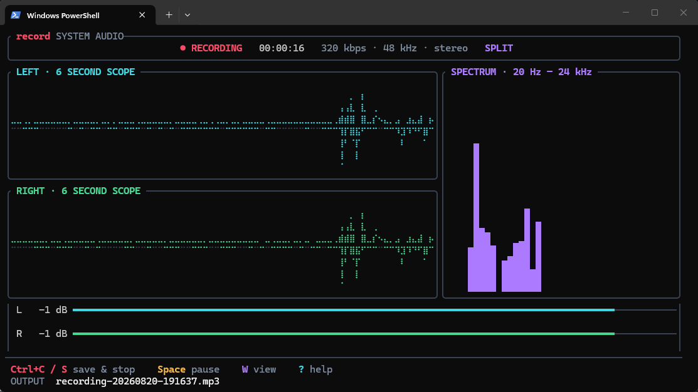

# record

> Type `record`. Audio capture starts. Press `Ctrl+C`. Get an MP3.

[](https://github.com/irbto/record/actions/workflows/ci.yml)
[](LICENSE)
[](#platform-support)

## Fast by design

**23.89 ms median to active system audio capture.**

The primary startup metric measures time from process entry to active WASAPI loopback capture. It also verifies that the native MP3 sink is ready.

The `RECORDING` state appears only after the MP3 writer opens and `IAudioClient::Start` succeeds. Thus, `record` means that audio capture is active.

| Reference metric | Median | Minimum | Budget |
|---|---:|---:|---:|
| Audio capture ready | 23.89 ms | 22.87 ms | 100 ms |
| CLI process | 11.22 ms | 10.32 ms | 50 ms |

These results use Windows 11 Pro N build 26200 and an AMD Ryzen 5 5600X. Results on other computers can be different.

Read the [benchmark notes](benchmarks/README.md) for the metric definitions. You can also run the benchmark on your computer.



## Record with one command

`record` is a native Windows terminal program. It records system audio from the default output device. It does not record microphone audio.

```powershell
record
```

Capture starts without a source menu. Press `Ctrl+C` to stop. The MP3 file is in the current directory.

## Features

- `record` captures applications that send audio to the default playback device.
- Windows Media Foundation writes a stereo MP3. The default bitrate is 320 kbps.
- The TUI shows stereo waveforms, level meters, a spectrum, and a split view.
- `Ctrl+C`, `S`, `Q`, and `Esc` stop capture and finalize the MP3.
- The saved file name is a clickable link in terminals that support OSC 8.
- Pause, timed capture, selected output paths, and headless operation are available.
- One native executable contains the program. FFmpeg and runtime services are not necessary.

## Install

### PowerShell installer

Use this command. You do not need Rust or FFmpeg.

```powershell
irm https://raw.githubusercontent.com/irbto/record/main/install.ps1 | iex
```

The installer does these tasks:

1. It downloads the latest `record.exe`.
2. It verifies the SHA-256 checksum.
3. It installs the file in `%LOCALAPPDATA%\Programs\record`.
4. It adds that directory to the current shell and the persistent user `PATH`.

You can use `record` immediately after the installer is complete.

### Portable executable

Download [record.exe](https://github.com/irbto/record/releases/latest/download/record.exe) from the [latest GitHub release](https://github.com/irbto/record/releases/latest). You can start this file without installation.

The release also contains a ZIP file and SHA-256 checksum files.

### Cargo

Use Cargo if its binary directory is already on `PATH`.

```powershell
cargo install --git https://github.com/irbto/record --locked
```

Cargo puts executables in `CARGO_HOME\bin`. The usual directory is `%USERPROFILE%\.cargo\bin`.

A standard rustup installation adds this directory to `PATH`. If Cargo gives a `PATH` warning, use the PowerShell installer.

## Controls

| Key | Action |
|---|---|
| `Ctrl+C`, `S`, `Q`, `Esc` | Stop capture, finalize the MP3, and exit |
| `Space` | Pause or continue capture |
| `W` | Select waveform, spectrum, or split view |
| `?` | Show or hide help |

Paused time is not in the MP3.

## CLI

```text
record [OPTIONS]
record doctor

Options:
  -o, --output <FILE>       Output path (defaults to the current directory)
  -b, --bitrate <BITRATE>   k128, k192, k256, or k320 [default: k320]
  -d, --duration <SECONDS>  Stop automatically, including fractional seconds
      --no-tui              Use line output for scripts or pipes
  -f, --force               Replace an existing output file
```

Examples:

```powershell
# Start capture. Press Ctrl+C to stop.
record

# Record a 30-second file at 192 kbps.
record -d 30 -b k192 -o demo.mp3

# Test the audio endpoint and MP3 encoder. Do not record audio.
record doctor
```

## Startup design

The no-argument path does not start the general CLI parser. The main thread starts the audio worker before it starts the TUI.

The audio worker opens the MP3 writer and starts the WASAPI client. It then sends the `AudioEvent::Started` event.

The TUI shows `STARTING` before this event. It shows `RECORDING` only after this event.

The waveform history grows as necessary. The FFT planner starts only when you select a spectrum view.

A bounded channel carries visualization data. The audio thread does not wait for terminal rendering.

Read the [architecture notes](docs/architecture.md) for more information.

Run the startup benchmark with this command:

```powershell
.\scripts\benchmark-startup.ps1 -Runs 30 -Enforce
```

## Platform support

Windows 10 and Windows 11 are supported. macOS and Linux capture backends are not available.

System audio is the shared-mode mix from the current default playback endpoint. `record` does not capture audio from a different device.

Protected media, exclusive-mode streams, and microphone input are not part of this mix.

## Project status

This is an early open-source release. Windows capture and native MP3 encoding have hardware smoke tests.

Device switching, metadata, and other operating systems are future work.

Read [CONTRIBUTING.md](CONTRIBUTING.md) before you send a change. This project uses the [MIT License](LICENSE).
